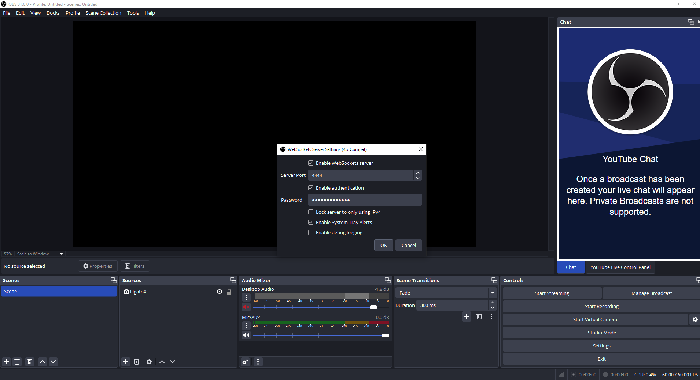
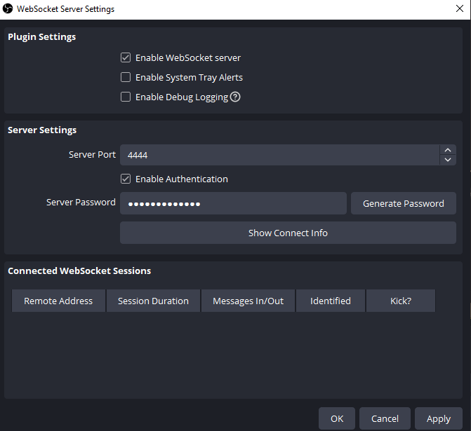
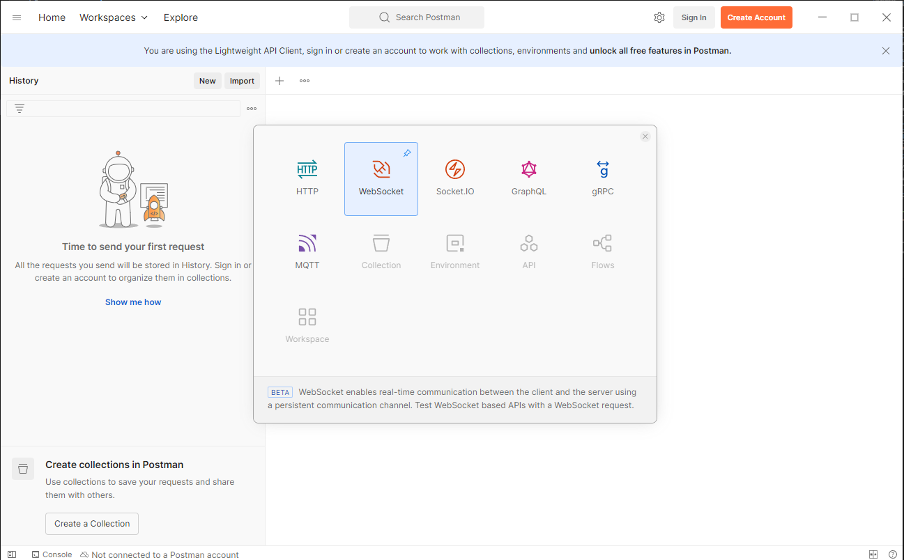
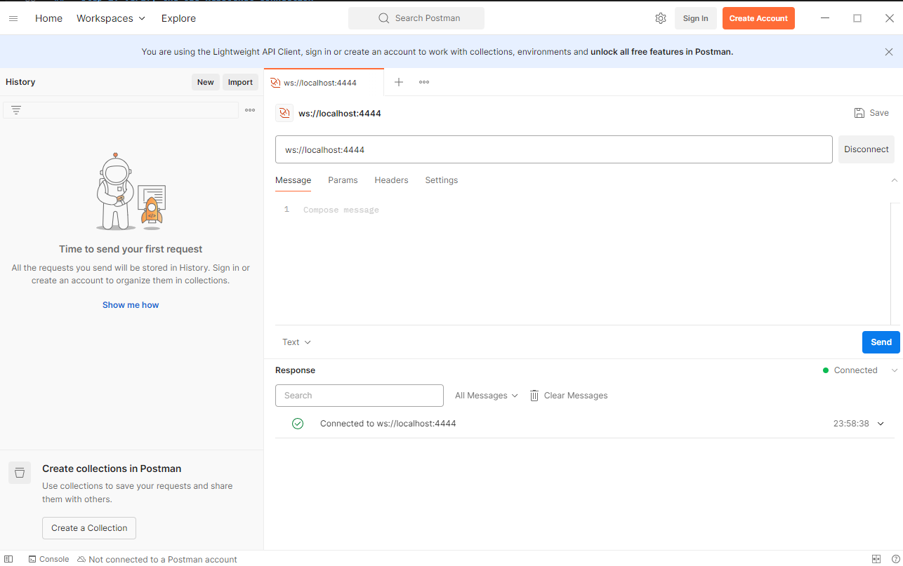
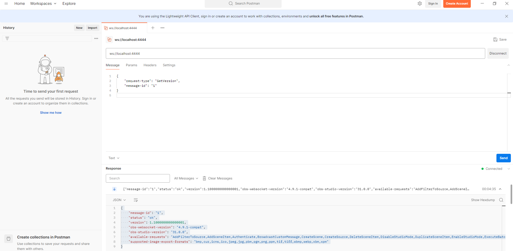
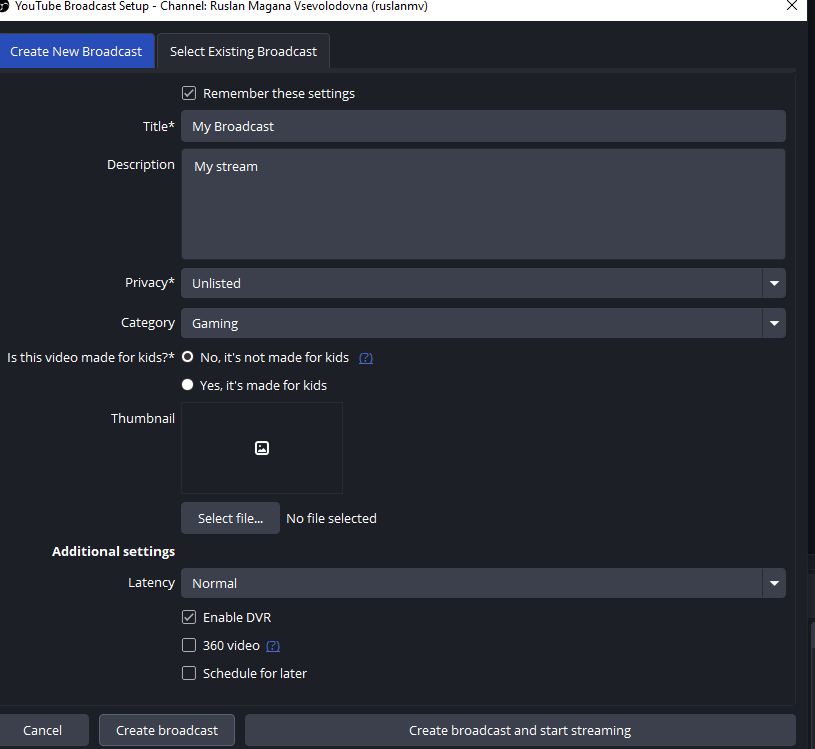

# Integrating Artificial Intelligence with OBS Streaming

In this blog post, we will develop a powerful application that integrates OBS Studio streaming with advanced Artificial Intelligence techniques, including Object Detection and Real-Time Subtitles. Imagine creating a real-time monitoring dashboard that identifies every object on the screen while displaying subtitles of the person speaking in real time. This application combines the capabilities of OBS Virtual Camera, Python, YOLO for object detection, and speech-to-text technologies to deliver an enhanced streaming experience.

---

## **File Structure**

Below is the suggested file structure for the project:

```
obs_ai_project/
|-- main.py                # Main Python script integrating object detection and subtitles
|-- obs_control.py         # Python script for OBS WebSocket integration
|-- virtual_camera.py      # Python script for Virtual Camera interaction
|-- requirements.txt       # Python dependencies
|-- README.md              # Documentation
```

---

## **Step 1: Setting Up the Environment**

We will use Conda 24.5.0 to create and manage the environment for this project. Conda allows for efficient package management and isolation of dependencies.

### **Steps to Create the Conda Environment:**

1. **Install Conda**: If not already installed, download and install Conda from [Anaconda](https://www.anaconda.com/products/distribution) or [Miniconda](https://docs.conda.io/en/latest/miniconda.html).

2. **Create the Environment**: Create a new Conda environment named `obs`.
   ```bash
   conda create -n obs python=3.12.4 -y
   ```

3. **Activate the Environment**:
   ```bash
   conda activate obs
   ```

4. **Install Required Packages**:
   ```bash
   pip install ultralytics opencv-python SpeechRecognition obs-websocket-py
   ```

5. **Verify Installation**:
   Ensure all packages are installed by checking their versions:
   ```bash
   pip show ultralytics opencv-python SpeechRecognition obs-websocket-py
   ```


## **Step 2: Setting Up OBS and Installing WebSocket Plugin**

To get started, you first need to install OBS Studio and its WebSocket plugin. This will allow Python to communicate with OBS, enabling features like scene switching, starting/stopping streams, and more.

### **Installing OBS Studio**

1. **Download the official version of OBS Studio**:
   - Visit the [OBS Studio Download Page](https://obsproject.com/download) and choose the version for your operating system.

2. **Install OBS Studio**:
   - Follow the installation wizard for your platform (Windows, macOS, or Linux).

3. **Windows Specific Note**:
   - If using the `.zip` method to install OBS Studio outside the standard `Program Files` directory, ensure you add the security group `ALL APPLICATION PACKAGES` to have full control over the OBS Studio directory and subdirectories. This is critical for certain features like game capture on UWP apps.

### **Installing OBS WebSocket Plugin**

The OBS WebSocket plugin allows external applications to communicate with OBS via WebSocket. Follow the steps below to install it:

1. **For Windows**:
   - Using the installer (recommended): Download [obs-websocket-4.9.1-compat-Qt6-Windows-Installer.exe](https://github.com/obsproject/obs-websocket/releases) and run the installer.
   - Alternatively, download the `.zip` version and copy its contents to the root directory of OBS Studio (e.g., `C:\Program Files\obs-studio`).

2. **For macOS**:
   - Download the `obs-websocket-4.9.1-compat-Qt6-macOS.pkg` file and run the installer. This binary works on both Intel and Apple Silicon Macs.

3. **For Debian/Ubuntu (64-bit)**:
   - Download the `obs-websocket-4.9.1-compat-Ubuntu64.deb` package and install it on your system using:
     ```bash
     sudo dpkg -i obs-websocket-4.9.1-compat-Ubuntu64.deb
     ```

To use obs_control.py with the OBS settings shown in your image, follow these steps to configure OBS for WebSocket integration:

## Step 1: Enable OBS WebSocket

1. Enable OBS WebSocket
Open OBS Studio.

2. Check Enable WebSocket server.
Set the Port to 4444 (default port in your script).
Navigate to **Tools** > **WebSocket Server Settings**. Enable the WebSocket Server.
3. Ensure the WebSocket server is enabled and note the port (default is `4444`). 
Optionally, set a Password (e.g., your_password).
Click OK to save the changes.



## **Step 1: Install Postman**

1. **Download Postman**:  
   If you haven't already, download and install Postman from the [official website](https://www.postman.com/downloads/).

2. **Launch Postman**:  
   Open the Postman application on your computer.

---

## **Step 2: Verify the OBS WebSocket Connection**

### **1. Create a New WebSocket Request**

- On the Postman dashboard, locate and click the **`New`** button at the top-left corner.
- A pop-up menu will appear with various options such as:
   - HTTP Request  
   - WebSocket Request  
   - gRPC Request, etc.

- **Select** the **WebSocket Request** option. This opens the interface to test WebSocket connections.

---

### **2. Enter the WebSocket URL**

- In the "Enter request URL" field (located at the top), enter the WebSocket server address.  
   - For testing purposes, use the **echo WebSocket server**:  
     ```
     wss://echo.websocket.events
     ```
   - If testing your local OBS WebSocket, the URL would be:  
     ```
     ws://localhost:4444
     ```
     Replace `4444` with the WebSocket port configured in your OBS settings.

---

### **3. Connect to the WebSocket Server**

- Once you’ve entered the WebSocket URL, click the **Connect** button (located to the right of the URL field).
- If the connection is successful, Postman will indicate the connection status in the response panel, typically showing **Connected**.

---

### **4. Send a Message**

- After establishing a connection, you can send messages to the server:  
   1. Go to the **Message** tab below the URL field.  
   2. Choose the message format from the dropdown (e.g., **Text**, **JSON**, **XML**).  
   3. In the message input area, type a test message, such as:  
      ```
      {
    "request-type": "GetVersion",
    "message-id": "1"
}

      ```
   4. Click **Send**.

---

### **5. Observe the Response**

- The server will **echo your message** back to you. For example:
   - If you sent `      {
    "request-type": "GetVersion",
    "message-id": "1"
}`, the response area will display:
     ```
     {
    "message-id": "1",
    "status": "ok",
    "version": 1.1000000000000001,
    "obs-websocket-version": "4.9.1-compat",
    "obs-studio-version": "31.0.0",
    "available-requests": "AddFilterToSource,..,TriggerHotkeyBySequence",
    "supported-image-export-formats": "bmp,cur,icns,ico,jpeg,jpg,pbm,pgm,png,ppm,tif,tiff,wbmp,webp,xbm,xpm"
}
     ```

     
- This confirms that the WebSocket server is responding as expected.

---

## **Step 3: Test OBS WebSocket Connection**

If you are using OBS WebSocket, follow these steps:

1. Open OBS Studio and ensure that **OBS WebSocket** is enabled:
   - Go to **Tools > WebSocket Server Settings**.
   - Verify that the WebSocket server is **enabled** and note the port (default: `4444`).

2. Use the same procedure in Postman but connect to OBS:
   - URL: `ws://localhost:4444`
   - Connect and send a test message to verify the connection.


---

## **Step 4: Configure OBS Stream Settings**

1. Open OBS Studio and go to **Settings > Stream**.
2. Under **Service**, choose your preferred streaming platform, such as:
   - **YouTube** (RTMPS)
   - **Twitch**
   - **Vimeo**

3. Enter the **Server** and **Stream Key** provided by the streaming platform:
   - These credentials are usually found in your platform's dashboard under the streaming setup options.

4. Click **Apply** and then **OK** to save changes.

---


---

## **Step 1: Set Up a Broadcast Destination in OBS**

1. **Open OBS Studio**.
2. Navigate to the **Settings**:
   - Click on **File > Settings** in the top menu bar.
   - Alternatively, click on the **Settings** button in the bottom-right corner.

3. Go to the **Stream** tab:
   - This is where you set up your streaming platform.

4. Select your **Streaming Service**:
   - Choose your desired platform from the **Service** dropdown menu:
     - Options include **YouTube**, **Twitch**, **Facebook Live**, **Vimeo**, and others.
     - If you’re using a custom RTMP server, select **Custom...**.

5. Enter the **Server** and **Stream Key**:
   - For services like YouTube or Twitch:
     - Retrieve the **Stream Key** from your account dashboard (on the streaming platform).
     - Copy the key and paste it into the **Stream Key** field in OBS.
     - OBS will automatically fill the server details for popular platforms.
   - For custom RTMP setups:
     - Provide the **RTMP Server URL** and **Stream Key** manually.

6. Click **Apply** and **OK** to save your changes.




---

## **Step 2: Test Your Broadcast Configuration**

1. In OBS, click the **Start Streaming** button manually to confirm the configuration is correct.
2. Ensure your broadcast appears live on your streaming platform.

---

## **Step 3: Verify the OBS WebSocket API Integration**

Now that the broadcast destination is configured:

1. Run your script **`obs_control.py`** again:
   ```bash
   python obs_control.py
   ```
2. The following actions should now work:
   - Switch scenes.
   - Start streaming.
   - Stop streaming.

3. Verify that streaming starts successfully in OBS without the **"No Broadcast Configured"** error.


---

## **Step 2: OBS WebSocket API Integration**

OBS WebSocket is a plugin for OBS Studio that allows external applications to control and communicate with OBS using WebSocket. This is crucial for managing scenes, starting/stopping streams, and more.

### **File: `obs_control.py`**

```python
from obswebsocket import obsws, requests, exceptions

# Connection details
host = "localhost"
port = 4444  # Default WebSocket port
password = "your_password"  # Change if you set a password

try:
    # Connect to OBS WebSocket
    print("Connecting to OBS WebSocket...")
    ws = obsws(host, port, password)
    ws.connect()
    print("Connected to OBS WebSocket!")

    # Example: Switch to a specific scene
    scene_name = "Scene Name"  # Replace with the name of a scene in OBS
    print(f"Switching to scene: {scene_name}")
    ws.call(requests.SetCurrentScene(scene_name=scene_name))
    print(f"Successfully switched to scene: {scene_name}")

    # Example: Start Streaming
    print("Starting streaming...")
    ws.call(requests.StartStreaming())
    print("Streaming started successfully!")

    # Example: Stop Streaming
    print("Stopping streaming...")
    ws.call(requests.StopStreaming())
    print("Streaming stopped successfully!")

except exceptions.ConnectionFailure:
    print("Failed to connect to OBS WebSocket. Check if OBS WebSocket server is running.")
except Exception as e:
    print(f"An error occurred: {e}")
finally:
    # Disconnect
    try:
        ws.disconnect()
        print("Disconnected from OBS WebSocket.")
    except:
        pass

```

### **Steps to Integrate:**

1. **Run the Script**:
   ```bash
   python obs_control.py
   ```

This script allows you to control OBS directly from Python, such as switching scenes or starting and stopping streams programmatically. It lays the foundation for integrating AI features.

---


## Step 2: Start the Virtual Camera
Look at the bottom-right corner of the OBS window.

Locate the Controls panel (next to Start Streaming and Start Recording).

Click the Start Virtual Camera button.


Once activated:

The Start Virtual Camera button will change to Stop Virtual Camera.
This confirms that the Virtual Camera is running.

## **Step 3: Virtual Camera Integration**

OBS has a virtual camera feature that allows the OBS output to be used as a webcam in other applications. You can process or interact with this virtual camera using Python.

### **File: `virtual_camera.py`**

```python
import cv2

# Access OBS Virtual Camera
cap = cv2.VideoCapture(0)  # Replace 0 with the correct camera index if needed

while True:
    ret, frame = cap.read()
    if not ret:
        break

    # Process the frame (e.g., overlay text or graphics)
    cv2.putText(frame, "Live Streaming!", (50, 50), cv2.FONT_HERSHEY_SIMPLEX, 1, (255, 0, 0), 2)

    # Display the frame
    cv2.imshow("OBS Stream", frame)

    if cv2.waitKey(1) & 0xFF == ord('q'):
        break

cap.release()
cv2.destroyAllWindows()
```

### **Steps to Run the Script:**

1. Enable OBS Virtual Camera in OBS Studio.
2. Run the script:
   ```bash
   python virtual_camera.py
   ```

This script captures video from the OBS Virtual Camera and processes it frame by frame.


## Example Output
```bash
Detecting available cameras...

[0] Camera Index 0
[1] OBS Virtual Camera (Default)
[2] Camera Index 2

Defaulting to: OBS Virtual Camera (Default) (Index: 1)

Enter camera index to use (default is 1): 1
Using: OBS Virtual Camera (Default) (Index: 1)

Press 'q' to quit the video stream.
```
We have the following features:

Automatic Detection: Identifies all active cameras.
OBS Virtual Camera: Sets OBS Virtual Camera as the default if available.
User Input: Allows the user to manually choose a camera index.
Small Window Display: A compact window with a text overlay ("Live Streaming!").

---

## **Step 4: Integration with YOLO for Object Detection**

Object detection adds another layer of interactivity by identifying and labeling objects in real time.

### **File: `main.py`**

```python
import cv2
import time
from ultralytics import YOLO

def detect_cameras():
    """
    Detect available cameras and return the indices of all cameras.
    OBS Virtual Camera is prioritized if found.
    Returns:
        - A dictionary of available cameras with their index and name.
        - The default OBS Virtual Camera index if detected.
    """
    available_cameras = {}
    obs_index = None

    print("Detecting available cameras...\n")
    for index in range(10):  # Test camera indices 0 to 9
        cap = cv2.VideoCapture(index, cv2.CAP_DSHOW)
        if cap.isOpened():
            ret, _ = cap.read()
            if ret:
                # Name OBS Virtual Camera as default if detected
                camera_name = f"Camera Index {index}"
                if index == 1:  # OBS Virtual Camera is typically at index 1
                    camera_name = "OBS Virtual Camera (Default)"
                    obs_index = index

                available_cameras[index] = camera_name
                print(f"[{index}] {camera_name}")
            cap.release()

    if not available_cameras:
        print("No cameras detected. Ensure OBS Virtual Camera or webcam is enabled.")
        exit(1)

    return available_cameras, obs_index

def main():
    # Detect all cameras and prioritize OBS Virtual Camera
    cameras, obs_index = detect_cameras()

    # Display detected cameras and let the user choose
    default_camera_index = obs_index if obs_index is not None else next(iter(cameras.keys()))
    print(f"\nDefault camera: {cameras[default_camera_index]} (Index: {default_camera_index})")

    user_input = input(f"Enter the camera index to use (default is {default_camera_index}): ")
    camera_index = int(user_input) if user_input.isdigit() and int(user_input) in cameras else default_camera_index
    print(f"\nUsing camera: {cameras[camera_index]} (Index: {camera_index})\n")

    # Initialize YOLOv8 model (pre-trained weights)
    model = YOLO("yolov8n.pt")  # Use yolov8n.pt or custom weights

    # Access the selected camera
    cap = cv2.VideoCapture(camera_index, cv2.CAP_DSHOW)
    if not cap.isOpened():
        print("Error: Cannot access the selected camera. Check if it's running.")
        exit()

    # Optionally set resolution
    cap.set(cv2.CAP_PROP_FRAME_WIDTH, 1280)
    cap.set(cv2.CAP_PROP_FRAME_HEIGHT, 720)

    # Initialize FPS calculation
    prev_time = time.time()

    print("Starting object detection on the selected camera feed...")
    window_name = "Object Detection"

    # Set up the display window
    cv2.namedWindow(window_name, cv2.WINDOW_NORMAL)
    cv2.resizeWindow(window_name, 640, 360)

    while True:
        # Capture frame-by-frame
        ret, frame = cap.read()
        if not ret:
            print("Error: Unable to capture frame.")
            break

        # Perform YOLO object detection
        results = model(frame)

        # Annotate the frame with bounding boxes and labels
        annotated_frame = results[0].plot()

        # Calculate FPS
        current_time = time.time()
        fps = 1 / (current_time - prev_time)
        prev_time = current_time

        # Display FPS on the frame
        cv2.putText(
            annotated_frame,
            f"FPS: {fps:.2f}",
            (20, 50),
            cv2.FONT_HERSHEY_SIMPLEX,
            1,
            (0, 255, 0),
            2,
        )

        # Display detection count
        detection_count = len(results[0].boxes) if results[0].boxes else 0
        cv2.putText(
            annotated_frame,
            f"Objects Detected: {detection_count}",
            (20, 90),
            cv2.FONT_HERSHEY_SIMPLEX,
            1,
            (0, 255, 0),
            2,
        )

        # Show the video feed
        cv2.imshow(window_name, annotated_frame)

        # Exit the loop on pressing 'q'
        if cv2.waitKey(1) & 0xFF == ord('q'):
            print("Exiting...")
            break

    # Release resources
    cap.release()
    cv2.destroyAllWindows()

if __name__ == "__main__":
    main()


```

### **Steps to Run the Script:**

1. Ensure OBS Virtual Camera is running.
2. Run the script:
   ```bash
   python main.py
   ```

This script captures video from the OBS Virtual Camera and performs real-time object detection using YOLOv8.

---

## **Step 5: Real-Time Subtitles with Speech-to-Text**

Adding real-time subtitles improves accessibility by transcribing speech into text.

### **File: `run.py` **

```python
import cv2
import time
import threading
from ultralytics import YOLO
import speech_recognition as sr

# Global variable for subtitles
subtitle_text = ""

def detect_cameras():
    """
    Detect available cameras and return the indices of all cameras.
    OBS Virtual Camera is prioritized if found.
    """
    available_cameras = {}
    obs_index = None

    print("Detecting available cameras...\n")
    for index in range(10):  # Test camera indices 0 to 9
        cap = cv2.VideoCapture(index, cv2.CAP_DSHOW)
        if cap.isOpened():
            ret, _ = cap.read()
            if ret:
                # Name OBS Virtual Camera as default if detected
                camera_name = f"Camera Index {index}"
                if index == 1:  # OBS Virtual Camera is typically at index 1
                    camera_name = "OBS Virtual Camera (Default)"
                    obs_index = index

                available_cameras[index] = camera_name
                print(f"[{index}] {camera_name}")
            cap.release()

    if not available_cameras:
        print("No cameras detected. Ensure OBS Virtual Camera or webcam is enabled.")
        exit(1)

    return available_cameras, obs_index

def speech_to_text():
    """
    Runs speech recognition in a separate thread to avoid blocking video capture.
    Updates the global variable 'subtitle_text' with recognized speech.
    """
    global subtitle_text
    recognizer = sr.Recognizer()
    microphone = sr.Microphone()

    print("Initializing microphone for speech recognition...")
    with microphone as source:
        recognizer.adjust_for_ambient_noise(source)  # Calibrate for background noise

    while True:
        try:
            with microphone as source:
                audio = recognizer.listen(source, timeout=2, phrase_time_limit=3)
                subtitle_text = recognizer.recognize_google(audio)
        except sr.WaitTimeoutError:
            subtitle_text = ""  # No audio detected
        except sr.UnknownValueError:
            subtitle_text = ""  # Could not understand audio
        except Exception as e:
            print(f"Speech recognition error: {e}")
            subtitle_text = ""

def main():
    global subtitle_text

    # Detect all cameras and prioritize OBS Virtual Camera
    cameras, obs_index = detect_cameras()

    # Display detected cameras and let the user choose
    default_camera_index = obs_index if obs_index is not None else next(iter(cameras.keys()))
    print(f"\nDefault camera: {cameras[default_camera_index]} (Index: {default_camera_index})")

    user_input = input(f"Enter the camera index to use (default is {default_camera_index}): ")
    camera_index = int(user_input) if user_input.isdigit() and int(user_input) in cameras else default_camera_index
    print(f"\nUsing camera: {cameras[camera_index]} (Index: {camera_index})\n")

    # Ask user if they want to enable object detection
    use_object_detection = input("Do you want to enable object detection? (y/n): ").strip().lower()
    if use_object_detection == 'y':
        print("\nObject detection enabled. Initializing YOLOv8...")
        model = YOLO("yolov8n.pt")  # Initialize YOLO model
    else:
        print("\nObject detection disabled. Displaying subtitles only.")
        model = None

    # Access the selected camera
    cap = cv2.VideoCapture(camera_index, cv2.CAP_DSHOW)
    if not cap.isOpened():
        print("Error: Cannot access the selected camera. Check if it's running.")
        exit()

    # Set resolution
    cap.set(cv2.CAP_PROP_FRAME_WIDTH, 1280)
    cap.set(cv2.CAP_PROP_FRAME_HEIGHT, 720)

    # Start the speech recognition thread
    subtitle_thread = threading.Thread(target=speech_to_text, daemon=True)
    subtitle_thread.start()

    # Initialize FPS calculation
    prev_time = time.time()

    print("\nStarting video stream with speech-to-text subtitles...")
    window_name = "Video Stream with Subtitles"

    # Set up the display window
    cv2.namedWindow(window_name, cv2.WINDOW_NORMAL)
    cv2.resizeWindow(window_name, 640, 360)

    while True:
        # Capture frame-by-frame
        ret, frame = cap.read()
        if not ret:
            print("Error: Unable to capture frame.")
            break

        # Perform object detection if enabled
        if model:
            results = model(frame)
            annotated_frame = results[0].plot()  # Annotate the frame
        else:
            annotated_frame = frame.copy()  # No annotations, display raw frame

        # Calculate FPS
        current_time = time.time()
        fps = 1 / (current_time - prev_time)
        prev_time = current_time

        # Display FPS on the frame
        cv2.putText(
            annotated_frame,
            f"FPS: {fps:.2f}",
            (20, 50),
            cv2.FONT_HERSHEY_SIMPLEX,
            1,
            (0, 255, 0),
            2,
        )

        # Display real-time subtitles
        if subtitle_text:
            cv2.putText(
                annotated_frame,
                f"Subtitle: {subtitle_text}",
                (20, 90),
                cv2.FONT_HERSHEY_SIMPLEX,
                1,
                (0, 255, 255),
                2,
            )

        # Show the video feed
        cv2.imshow(window_name, annotated_frame)

        # Exit the loop on pressing 'q'
        if cv2.waitKey(1) & 0xFF == ord('q'):
            print("Exiting...")
            break

    # Release resources
    cap.release()
    cv2.destroyAllWindows()

if __name__ == "__main__":
    main()

```

### **Steps to Run the Script:**

1. Ensure OBS Virtual Camera is running.
2. Run the updated script:
   ```bash
   python main.py
   ```

This script combines object detection with real-time subtitles for an enhanced live streaming experience.

---

## **Further Enhancements**

1. **Stream Back to OBS:**
   - Use OBS WebSocket to send the annotated video back to OBS for live streaming.
2. **Custom Models:**
   - Train YOLO on specific datasets for custom object detection.
3. **Improved Transcription:**
   - Use advanced speech-to-text models for better subtitle accuracy.

---

By integrating OBS, YOLO, and speech-to-text, you can create a real-time AI-powered streaming application. This setup is ideal for live events, educational content, gaming, and more.

